# Tugas Administrasi Jaringan Minggu 1

## Instal Debian 12 pada VirtualBox 

Step 1: Download ISO image file from the [Official Debian website](https://www.debian.org/CD/http-ftp/)  

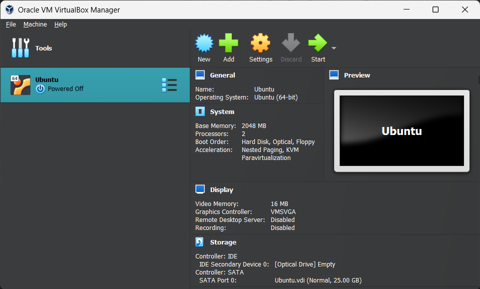  
  
Step 2: Buka virtualBox dan "add new machine". Link virtualBox jike belum install [here](https://www.virtualbox.org/wiki/Downloads)  
  
    
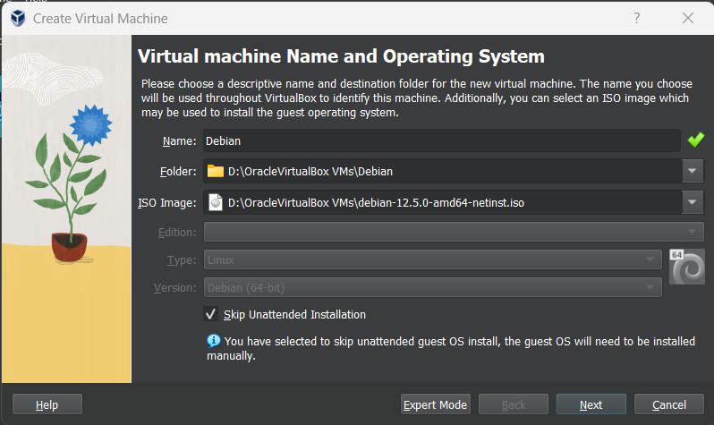  

Step 3: Beri nama machine baru lalu jika berkenan dapat mengganti folder tujuan jika space harddisk tidak cukup. Kemudian load ISO image file dan centang 'Skip unattended installation' lalu click next. 

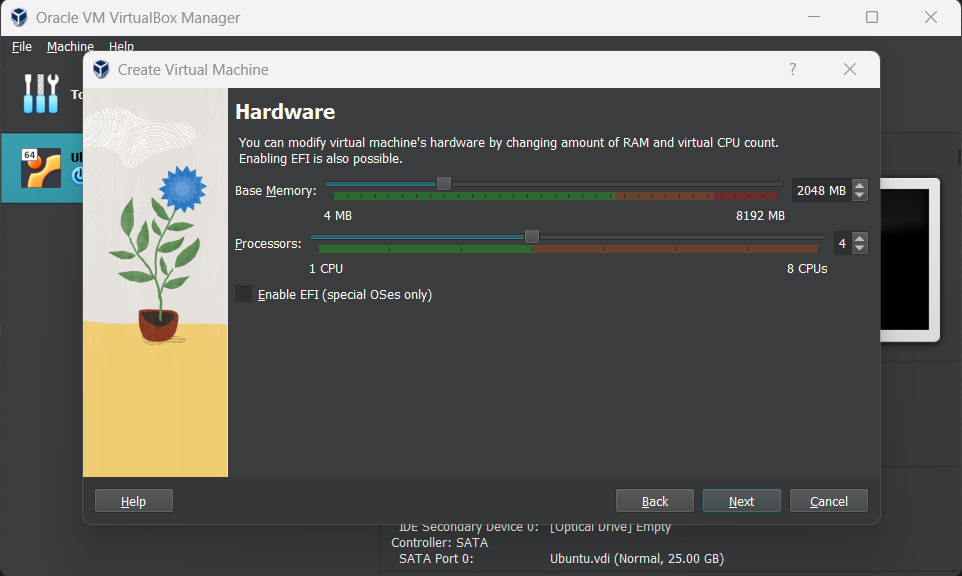  

Step 4: Atur Memory dan prosesor yang akan digunakan untuk VM.

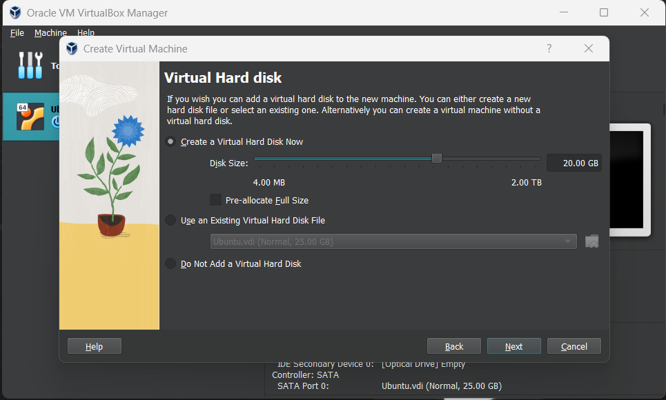  

Step 5 : Atur space harddisk yang akan digunakan lalu klik next.

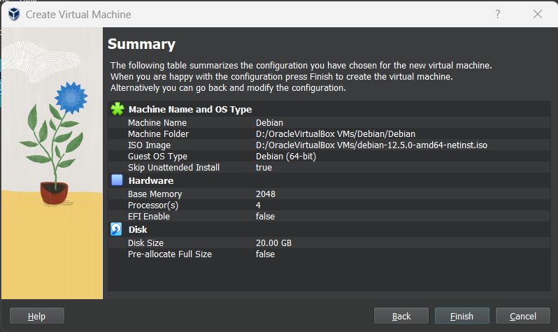

Step 6: Jika sudah cek lagi lalu  klik finish. Kemudian boot VM. 

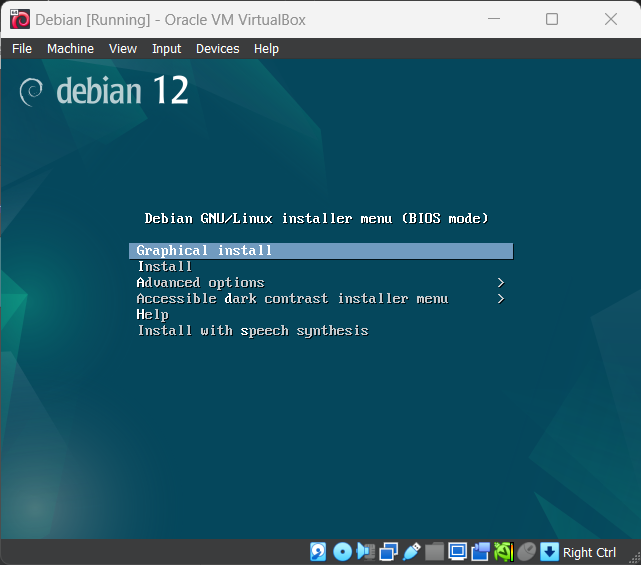

Step 7 : Pilih graphical install dan seting bahasa dan lokasi.

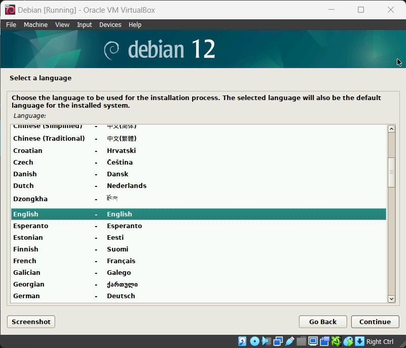
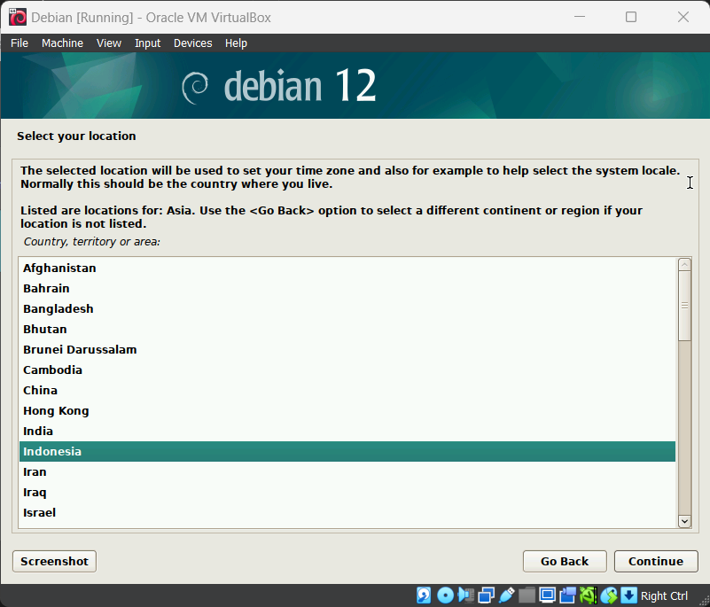
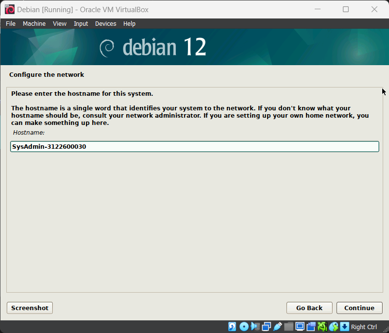

Step 8 : Berinama hostname dengan SysAdmin-NRP. Lalu set password dan seting waktu.

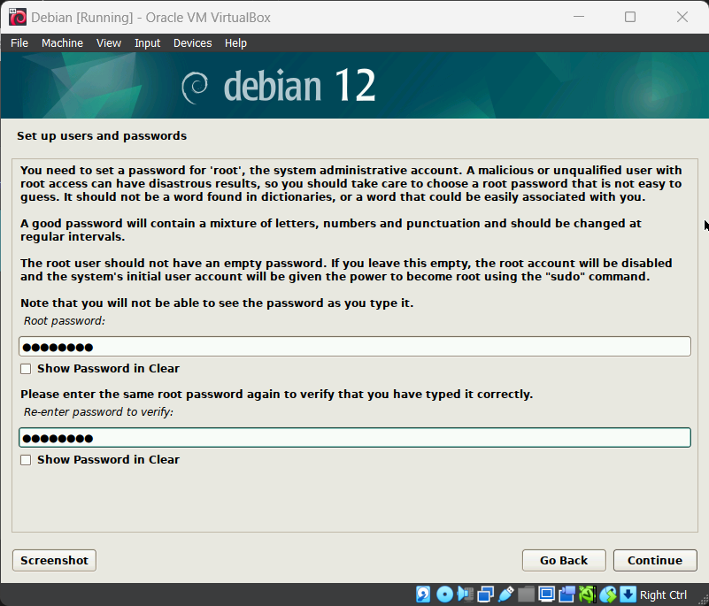
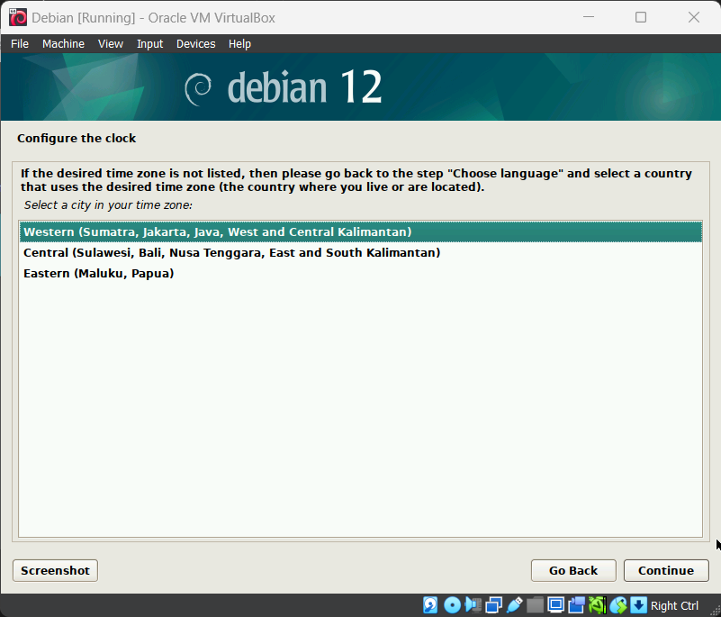
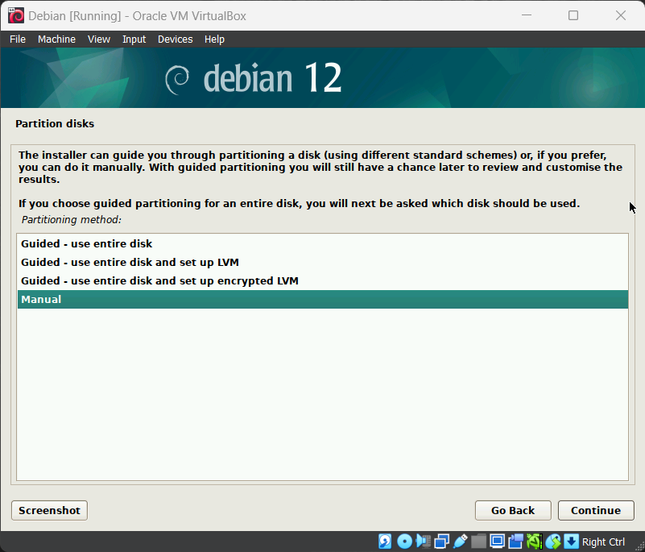

Step 9: Konfigurasi Partisi.

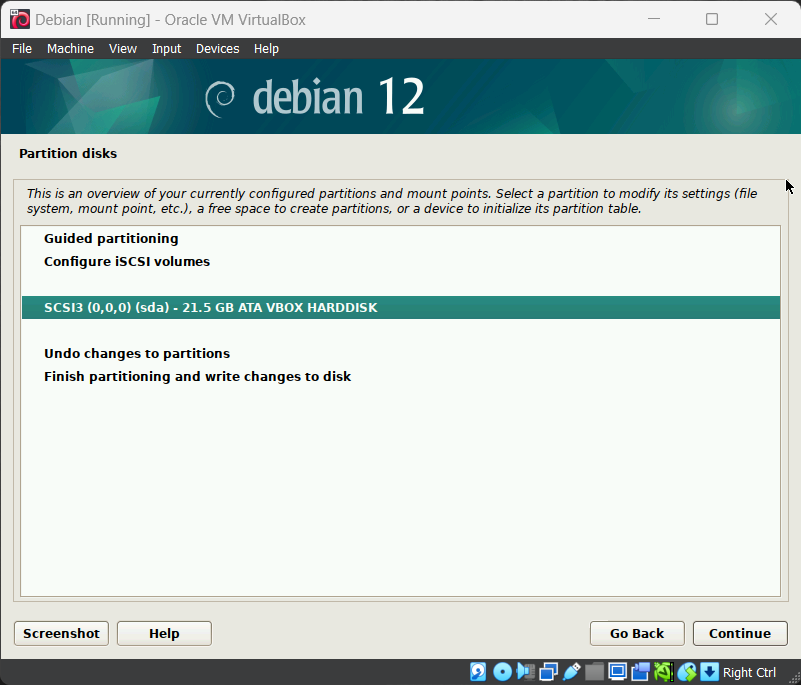
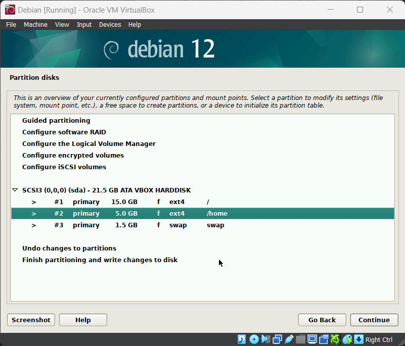

## Perbedaan Debian 12 (Bookworm) dengan Debian 11 (Bullseye)

| Perbedaan          | Debian 11 (Bullseye)  | Debian 12 (Bookworm) |
| -------------------|-----------------------|----------------------|
| Versi Kernel       | Linux 4.19 LTS        | Linux 5.10 LTS       |
| Kebutuhan Sistem   | 256 MB RAM, 2 GB Disk Space | 512 MB RAM, 2 GB Disk Space |
| Penerapan Sistem   | SysVinit sebagai system init default | systemd sebagai system init default |

| Package                                        | Debian 11 (Bullseye)  | Debian 12 (Bookworm) |
| -----------------------------------------------|-----------------------|----------------------|
| Apache                                         | 2.4.54                | 2.4.57               |
| Bash                                           | 5.1                   | 5.2.15               |
| BIND DNS Server                                | 9.16                  | 9.18                 |
| Cryptsetup                                     | 2.3                   | 2.6                  |
| Emacs                                          | 27.1                  | 28.2                 |
| Exim defaul e-mail server                      | 4.94                  | 4.96                 |
| GNU Compiler Collection as default Compiler    | 10.2                  | 12.2                 |
| GIMP                                           | 2.10.22               | 2.10.34              |
| GnuPG                                          | 2.2.27                | 2.2.40               |
| Inkscape                                       | 1.0.2                 | 1.2.2                |
| the GNU C library                              | 2.31                  | 2.36                 |
| Linux kernel image                             | 5.10 series           | 6.1 series           |
| LLVM/Clang toolchan                            | 9.0.1 and 11.0.1 (default) and 13.0.1 | 13.0.1 and 14.0 (default) and 15.0.6 |
| MariaDB                                        | 10.5                  | 10.11                |
| Nginx                                          | 1.18                  | 1.22                 |
| OpenJDK OpenLDAP                               | 11                    | 17                   |
| OpenSSH                                        | 2.4.57                | 2.5.13               |
| OpenSSL                                        | 8.4p1                 | 9.2p1                |
| Perl                                           | 5.32                  | 3.0.8                |
| PHP                                            | 7.4                   | 5.36                 |
| Postfix MTA                                    | 3.5                   | 8.2                  |
| PostgreSQL                                     | 13                    | 3.7                  |
| Python 3                                       | 3.9.2                 | 15                   |
| Rustc                                          | 1.48                  | 3.11.2               |
| Samba                                          | 4.13                  | 1.63                 |
| Systemd                                        | 247                   | 252                  |
| Vim                                            | 8.2                   | 9.0                  |

## Fungsi file "/etc/group"

File “/etc/group” bertugas menentukan entri grup system default untuk grup system yang mendukung beberapa tugas di seluruh system, seperti pencetakan, administrasi jaringa, atau surat elektronik. Karena Sebagian besar system linux menggunakan skema UPG, entri baru secarra otomatis dibuat di “/etc/group” Ketika pengguna baru ditambahkan. Nama grup sama dengan nama pengguna.  

Setiap entri dalam file “/etc/group” berisi empat bidang. Tanda titik dua memisahkan setiap bidang. Format entri file “/etc/group” secara default berupa :  

Groupname:group-password:GID:username-list  
Groupname : Berisi nama yang diberikan ke grup  
Group-password : berisi kata sandi yang di set x dan kata sandi user disimpan dalam file "/etc/shadow"  
GID : berisi nomor GID grup  
Username-list : Daftar pengguna yang menjadi anggota grup  

## Perbedaan perintah "su" dengan "su -"

Perintah “su” digunakan untuk beralih ke pengguna lain. Artinya mengubah ID pengguna selama sesi masuk. Jika telah dijalankan tanpa nama pengguna sebagai “su –“ akan login sebagai pengguna root sevara default. Perintah “su” merupakan singkatan dari switch user karena digunakan untuk beralih ke pengguna lain selama sesi login normal, tetapi sering disalahartikan sebagai singkatan untuk super user. Perintah “su” digunakan untuk mendapatkan hak super user seperti Ketika perintah su dijalankan tanpa nama pengguna, maka akan secara otomatis menjadi super user setelah memberikan kata sandi root yang benar yang kemudian akan masuk ke lingkungan default root. 

## Fungsi sudo

Perintah “sudo” memungkinkan pengguna untuk menjalankan berbagai tugas yang membutuhkan izin administrative atau root. Perintah in merupakan singkatan dari “SuperUser Do”. Hanya pengguna yang terdaftar di file “/etc/sudoers”yang dapat menjalankan perintah “sudo”. Saat menggunakan perintah “sudo”, pengguna akan dimintai kata sandi, karena perintah ini memungkinkan pengguna untuk mengontrol system secara penuh, seperti mengistal. Menghapus, atau mengubah perangkat lunak.

## Langkah-langkah penambahan user sebagai user sudo

Langkah 1 : Jalankan perintah "su -" pada terminal, lalu anda akan diminta untuk memasukkan password root anda, kemudian jalankan perintah "visudo", perintah ini digunakan untuk memodifikasi file /etc/sudoers.  

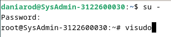

Langkah 2 : Scroll ke bawah sampai ketemu "#User privilige specification", kemudian tambahkan user anda. Sekarang user anda dapat melakukan perintah sudo.  

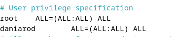  
