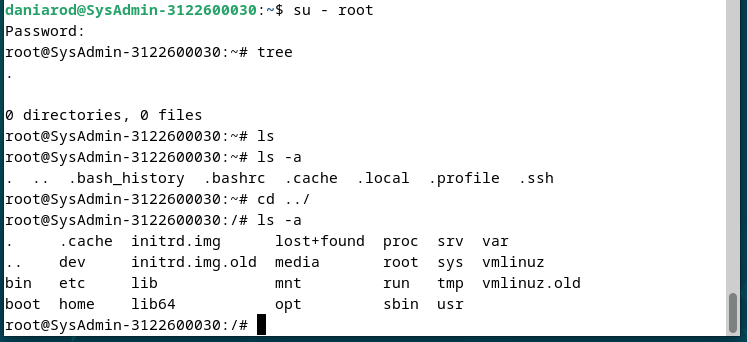
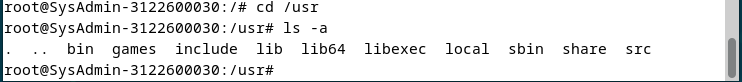
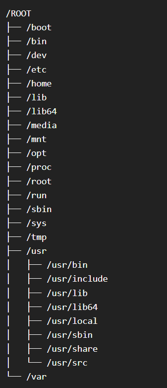

# Tugas Administrasi Jaringan Minggu 2  

## Standar Struktur Direktori pada Debian 

Format struktur direktori pada Windows berbeda dengan pada Linux, pada Windows menggunakan format D:\Folder\subfolder\file.txt, sedangkan pada Linux /Folder/subfolder/file.txt. Perbedaannya terdapat pada slashes atau garis miring, Linux menggunakan foward slash sedangkan Windows back slash. Selain itu pada Linux tidak terdapat nama drive (C:, D:) Seperti pada Windows.  

Struktur direktori pada Linux adalah struktur direktori terpadu dimana semua direktori disatukan di bawah sistem file Root "/". Tidak peduli dimana File System dipasang secara fisik, semua direktori disusun secara hierarki di bawah "Root file system".

Struktur direktori pada mengikuti "Filesystem Hierarchy Structure (FHS)" yang dikelola oleh Free Standard Group meskipun sebagian besar distribusi Linux kadang cenderung menyimpaang dari standar.  

  
  
  

### "/" Root

Struktur direktpri dimulai dengan Root file system "/" yang menjadikannya struktur keseluruhan. Partisi dimana "/" (direktori root) yang akan ditempatkan pada sistem yang kompatibel dengan UNIX.

### /boot

Direktori /boot berisi file Boot loader yang termasuk Grub atau Lilo, Kernel, initrd dan file konfigurasi system.map.

### /sys  

Berisi Kernel, Firmware dan file yang berkaitan dengan sistem.

### /sbin  

Berisi sistem binari dan alat administrasi sistem yang penting untuk operasi dan kinerja sistem.

### /bin  

Berisi binari penting untuk user dan utilitas yand diperlukan dalam mode pengguna tunggal. Contohnya antara lain cat, ls, cp dll.

### /lib  

Berisi file library untuk semua binari yang terdapat pada direktori /sbin dan /bin

### /dev  

Berisi file sistem penting dan drivers untuk hardware

### /etc  

Direktori /etc berisi file konfigurasi sistem penting meliputi /etc/hosts, /etc/resolv.conf, nsswitch.conf, default dan file konfigurasi jaringan. Sebagian bessar file konfigurasi sistem dan aplikasi khusus host.

### /home  

Semua direktori home user disimpan pada direktori ini. Berisi profile user, pengaturan pribadi seperti .profile dll.

### /media  

Titik pemasangan umum untuk media yang dapat dipindahkan seperti CD-ROM, USB, Disket, dll

### /mnt  

Titik pemasangan umum untuk sistem file sementara. Ini berguna khususnya ketika memecahkan masalah dari CDROM dll dimana diharus memasang sistem file Root dan mengedit konfigurasi

### /opt  

Direktori yang jarang digunakan dalam Linux untuk Optional Software Package. Banyak digunakan di OS UNIX seperti Sun Solaris di mana paket perangkat lunak diinstal.

### /usr/  

Sub-hirarki pada root file system yang digunakan menyimpan data user. Berisi utilitas dan aplikasi spesifik user. Terdapat banyak file sistem "important" tetapi tidak "critical". Terdapan sub-direktori bin, sbin, dan lib yang lain berisi biner pengguna dan sistem yang tidat "critical" dan library terkait dan direktori untuk berbagi.

### /usr/sbin  

Berisi biner sistem dan utilitas jaringan yang tidak "essential" dan tidak "critical".

### /usr/bin  

Berisi yang biner perintah yang tidak "essential" dan tidak "critical" untuk pengguna.

### /usr/lib  

Berisi file Library untuk binari di dalam direktori /usr/bin dan /usr/sbin. 

### /usr/share  

Direktori data bersama yang tidak bergantung pada  platform

### /usr/local  

Sub hierarki di bawah direktori /usr yang memiliki data spesifik sistem lokal termasuk biner sistem dan pengguna serta library nya.

### /var  

Direktori /var sebagian besar dipasang sebagai sistem file terpisah di bawah root di mana semua konten variabel seperti  log, file spool untuk printer, crontab, at jobs, mail, proses yang berjalan, file kunci, dll. Harus hati-hati dalam merencana file dan pemeliharaan karen ini dapat terisi cukup cepat dan ketika sistem file penuh dapat menyebabkan masalah operasional sistem dan aplikasi.

### /tmp  

Sistem file sementara yang menyimpan file-file sementara yang dibersihkan saat reboot sistem. Direktori /var/tmp juga menyimpan file-file sementara. Satu-satunya perbedaan antara keduanya adalah direktori /var/tmp menyimpan file yang dilindungi saat reboot sistem. Dengan kata lain, file /var/tmp tidak dihapus saat reboot.  

## Dasar Sistem Administrasi
