# Tugas 3 Administrasi Jaringan

## Pendapat Tentang Bagaimana Internet Bekerja

Ekosistem Internet terdiri dari beberapa bagian dan pihak yang mengatur serta mengelolanya sehingga membuat internet dapat bekerja. Pihak-pihak yang berada dalam ekosistem internet antara lain IANA, ICANN, IETF selain itu pemerintah juga turut andil dalam mengatur dan mengelola ekosistem internet. Setiap negara mendapatkan nama domain unik ccTLDs(country-code Top-Level Domains), dimana negara Tuvalu menerima PDB yang cukup tinggi karena ccTLDS nya berakhiran ".tv". Selain itu dalam ekosistem internet terdapat IP address dan Routing serta DNS (Domain Name Server), DNS mentranslasikan IP address ke Nama Server/Host. Terdapat 3 komponen DNS yaitu Namespace, NameServer, Resolvers/Clients.

## Bind9

1. Install bind9 melalu terminal dengan mengetikan perintah seperti pada gambar  

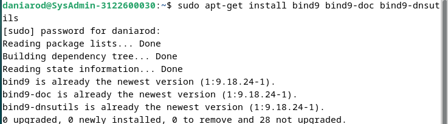

2. Cek dan konfigurasi file nya di /etc/bind  

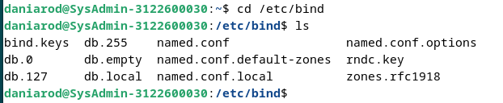

3. Buka dan konfigurasi file named.conf dan sesuaikan dengan gambar  

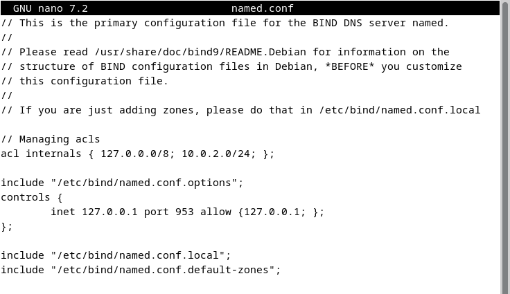

4. Buka dan konfigurasi file named.conf.default-zones dan sesuaikan dengan gambar  

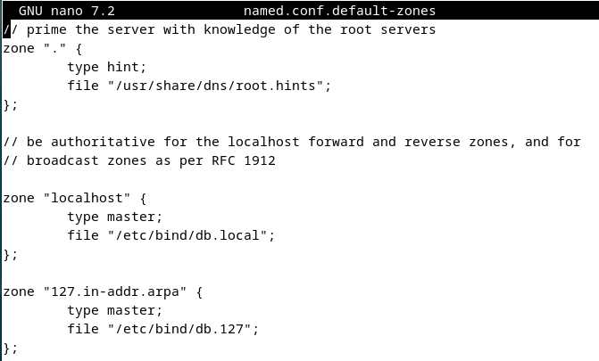
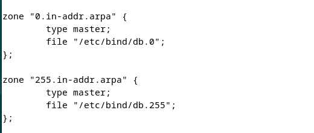

5. Buka dan konfigurasi file named.conf.options dan sesuaikan dengan gambar

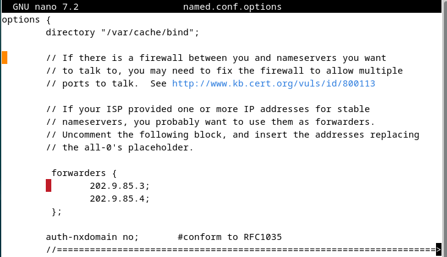
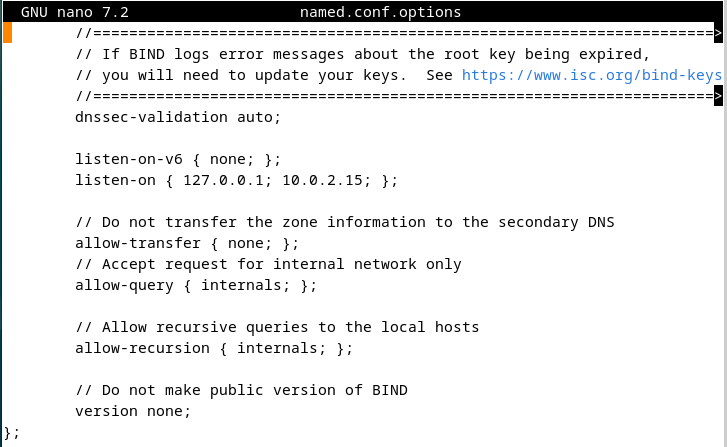

6. Buka dan konfigurasi file named.conf.local dan sesuaikan dengan gambar

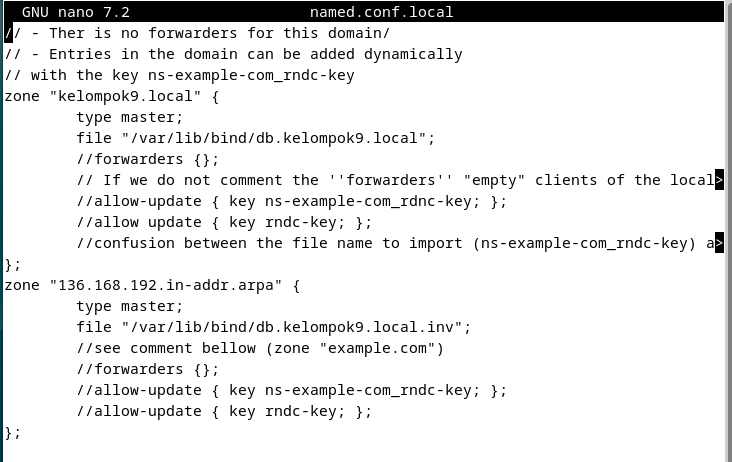

7. Kemudian lakukan pengecekan konfigurasi dengan sudo named-checkconf. Jika tidak ada error, maka konfigurasi sudah benar.

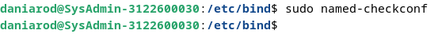

8. Lalu kita pindah ke folder /var/lib/bind dan konfigurasikan db.kelompok9.local seperti gambar

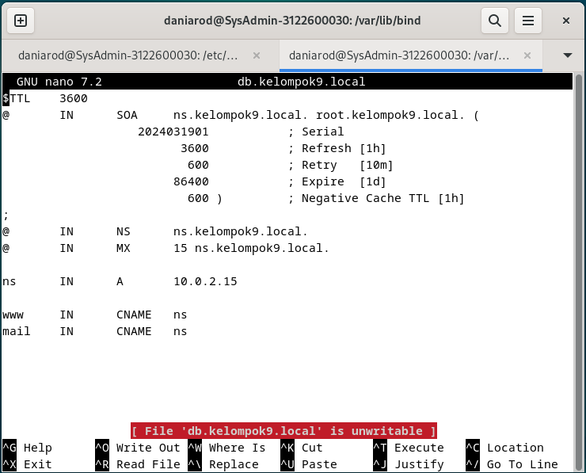

9. Konfigurasikan juga db.kelompok9.local.inv

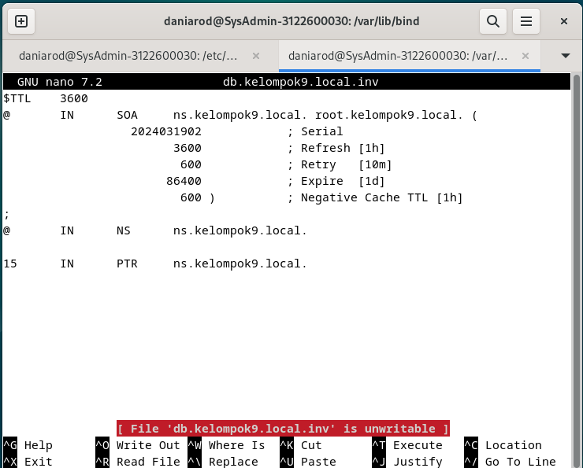

10. Lalu navigasikan dan konfigur file /etc/resolv.conf

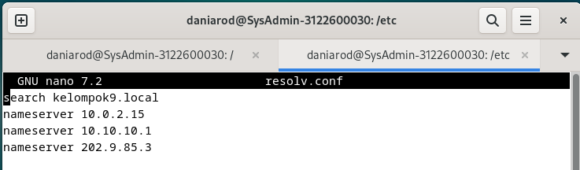

11. Jalankan perintah sudo systemctl restart named dan dig ns.kelompok9.local

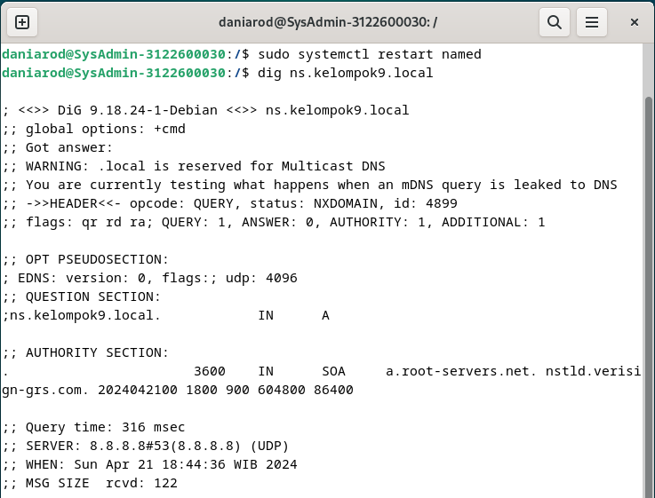

12. Jalankan  perintah nslookup

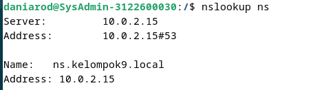